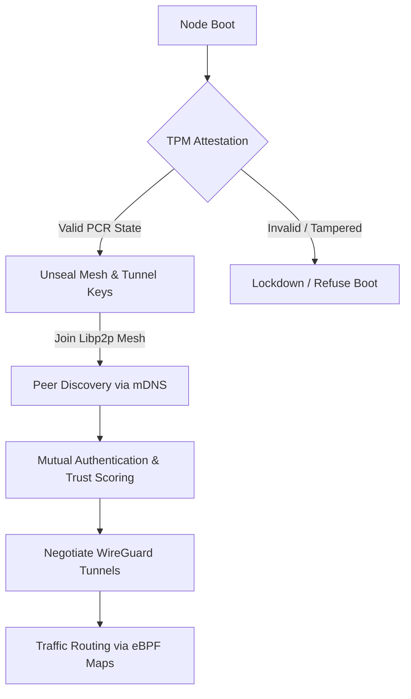
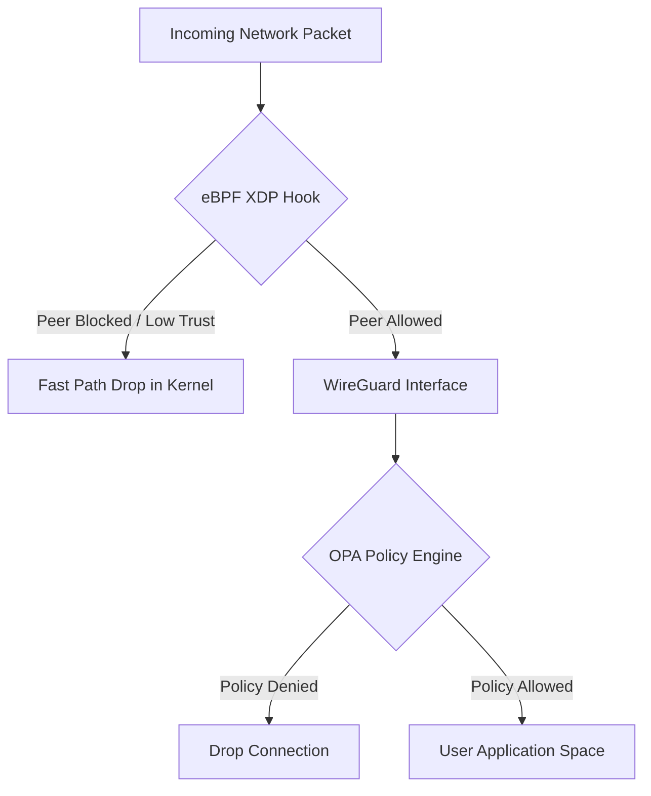

# DHARMA-ZT: Tactical Zero-Trust Mesh Network

 

**DHARMA-ZT** is an integrated, highly secure, decentralized tactical mesh network engineered in Go. It operates on the principles of Zero-Trust Architecture (ZTA) tailored for rapidly changing tactical environments (e.g., drone swarms, forward operating bases, vehicle relays). 

---

## 🛑 Problem Statement

In modern tactical or edge environments, traditional networking approaches fail due to several critical flaws:
1. **Centralized Points of Failure**: Reliance on central VPN gateways or certificate authorities creates single targets whose failure compromises the entire network.
2. **Implicit Trust**: Traditional networks blindly trust devices once they are inside the perimeter. If a single edge device (like a drone or relay node) is physically captured, the entire network is exposed.
3. **High Overhead & Latency**: Running software-based cryptographic routing on resource-constrained devices introduces unacceptable latency.
4. **No Identity Attestation**: Edge devices boot and join networks without cryptographically proving their hardware hasn't been tampered with.

## 💡 The Solution

DHARMA-ZT solves these problems by aggressively applying Zero-Trust principles to the network edge, leveraging a combination of state-of-the-art technologies:

- **Decentralized Mesh (Libp2p)**: Nodes discover each other automatically using mDNS and GossipSub, eliminating the need for central orchestration servers.
- **Hardware-Backed Root of Trust (TPM 2.0)**: Devices cannot join the mesh or decrypt their private keys unless their hardware Platform Configuration Registers (PCRs) cryptographically prove the system hasn't been tampered with.
- **Kernel-Level Enforcement (eBPF XDP)**: Packet filtering and routing decisions happen inside the Linux kernel *before* packets reach userspace, ensuring maximum performance and preventing DDoS attacks on the nodes.
- **Dynamic Policy & Trust Scoring (OPA)**: Open Policy Agent dynamically scores peers. If a peer begins acting suspiciously, its trust score drops, and eBPF instantly blocks it at the kernel level.
- **Zero-Day WireGuard Tunnels (wgctrl)**: Dynamic, ephemeral WireGuard interfaces are orchestrated entirely in-memory.

---

## 📐 Architecture & Flowcharts

The architecture is divided into the **Control Plane** (Identity, Policy, Discovery) and the **Data Plane** (eBPF, WireGuard). 

### Boot & Connection Flow



### Packet Enforcement Flow



---

## 🚀 Getting Started

### Prerequisites
- Docker & Docker Compose v2
- Linux Host (required for native eBPF XDP hook execution) 

### Running the Tactical Mesh Simulator

To spin up a simulated 3-node tactical environment (`commander`, `relay1`, `drone1`):

```bash
# Clone the repository
git clone https://github.com/imshivanshutiwari/DHARMA-ZT.git
cd DHARMA-ZT

# Build and start the mesh using Docker Compose
docker compose up --build
```
*Note: Due to the rigorous security limits of eBPF and TPM interactions, the Docker containers run in a `rugged` configuration requesting `CAP_SYS_ADMIN` and `CAP_NET_ADMIN` privileges.*

### 🛠️ CLI Node Management (`dharma-ctl`)

A CLI is provided to interact with active nodes over local gRPC for tactical field management.

```bash
# Toggle EMCON (Emission Control / Silent Running) 
# Halts all mDNS broadcasts and gossipsub traffic immediately
./dharma-ctl emcon on
./dharma-ctl emcon off

# Trigger Zeroize / Lockdown 
# Wipes all keys from memory and instructs eBPF to drop 100% of packets
./dharma-ctl node lockdown
```

---

## Code Structure
- **`pkg/identity`**: TPM 2.0 hardware interaction, Key Sealing, Attestation Quotes.
- **`pkg/ebpf`**: Go loaders for compiled `filter.c` BPF objects using Cilium.
- **`pkg/mesh`**: Libp2p peer discovery, EMCON toggles, internal event-driven PubSub.
- **`pkg/policy`**: Open Policy Agent engine evaluating Rego scripts against connection attempts.
- **`pkg/tunnel`**: Netlink interface building and wgctrl peer orchestrations.
